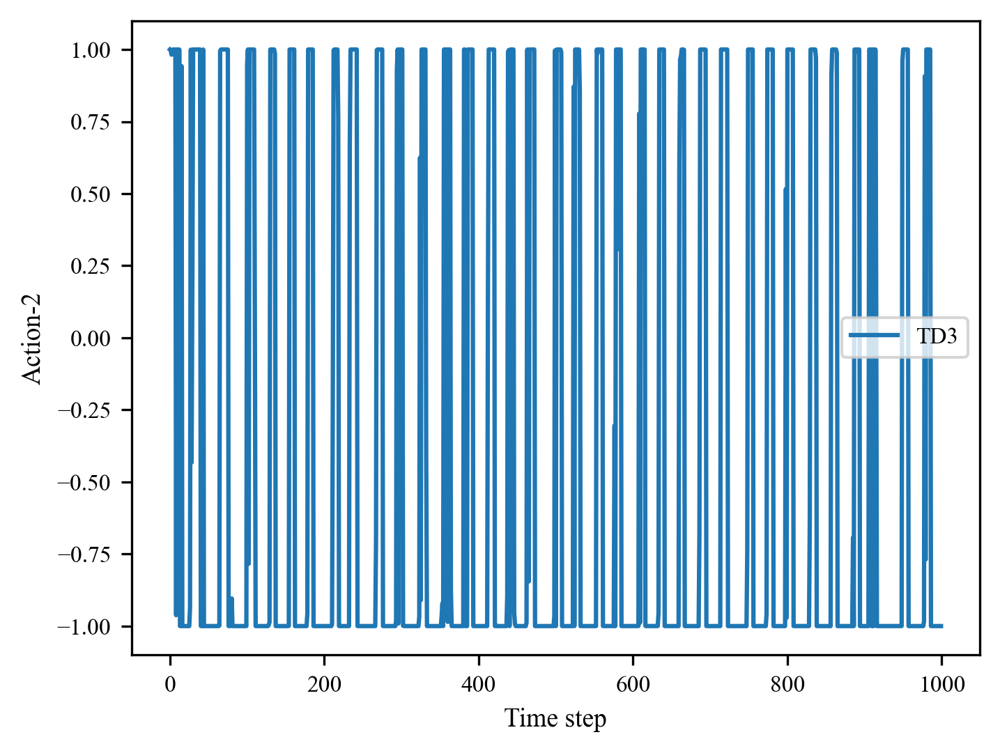

# ICLR Rebuttal

## For reviewer \#6JiW

**Question:** How does the architecture perform in environments requiring rapid reaction times?

**Answer:** FlipNet performs well in rapid reaction environments.

The DMControl-Cheetah is such a environment, where the actions need to change rapidly between -1 and 1 to make cheetah move fast. The following figures visualize the first two dimensions of action (actually, this rapid change presents in all 6 action dimensions).

- The first dimension of action in Cheetah

- The second dimension of action in Cheetah

FlipNet do not change this rapid reaction behavior in order to maintain a good enough control performance (see the left figure below), and try to reduce action fluctuation as much as possible (see the right figure below).

**In conclusion,** in rapid reaction environments, FlipNet performs effectively by reducing action fluctuations, all while ensuring that control performance is maintained.